## cmake 설치
1. cmake download : https://cmake.org/download/

## gtest 세팅
- mkdir gtestbuild
- cd gtestbuild  
- git clone https://github.com/google/googletest.git
- cmake googletest/googletest  
  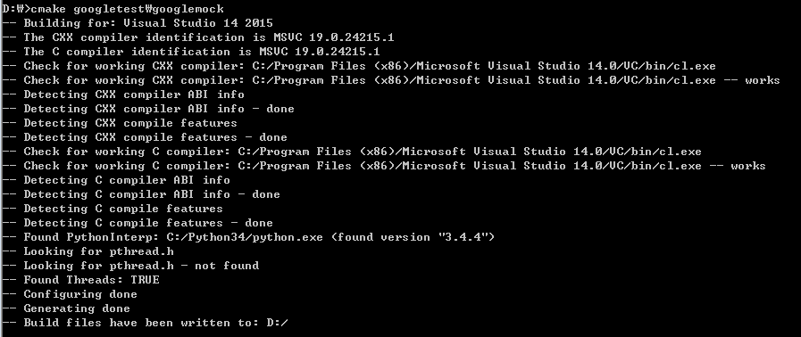  

- gtest.sln을 visual studio로 열기  
  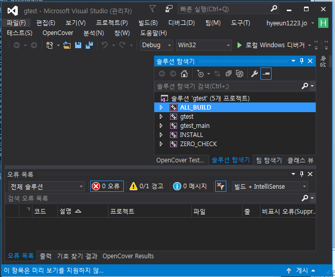  

- 솔루션 빌드
> Trouble Shooting  
  `경고가 오류로 처리되어 생성된 'object' 파일이 없습니다.`  
  gtest, gtest_main 모두 아래 속성 변경   
  경고를 오류로 처리 : 예 --> 아니오   
  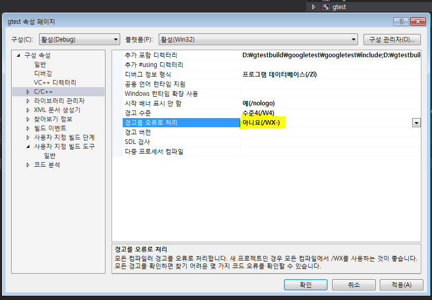   

- gtest.lib 생성 확인  
  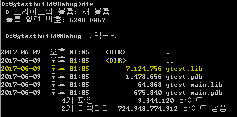  

## 테스트 대상 프로젝트 생성
gtest로 테스트를 하기위해서는 반드시 **정적 라이브러리** 형식이어야 됨  
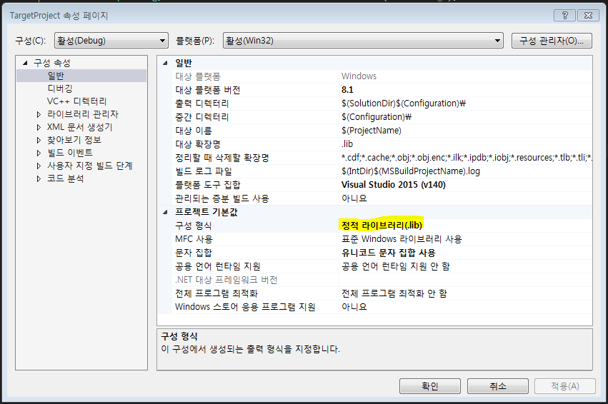  

## Unit Test를 위한 프로젝트 생성
- 포함디렉토리에 googletest 추가  
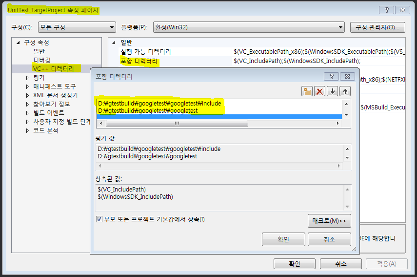  
- gtest.lib 라이브러리 링크 추가  
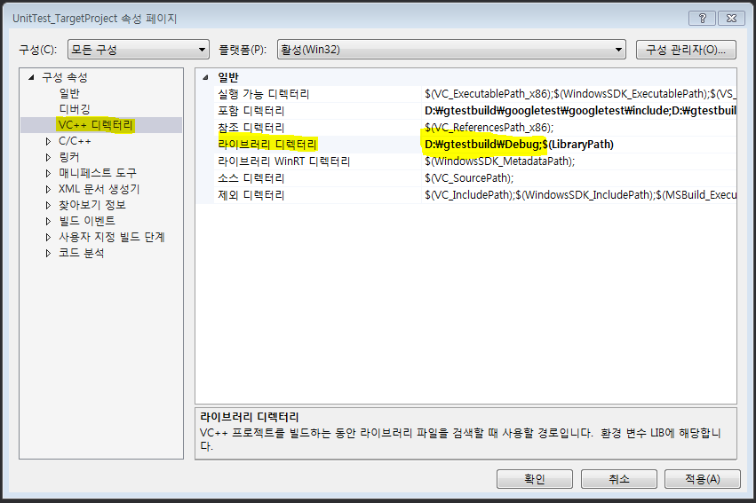   
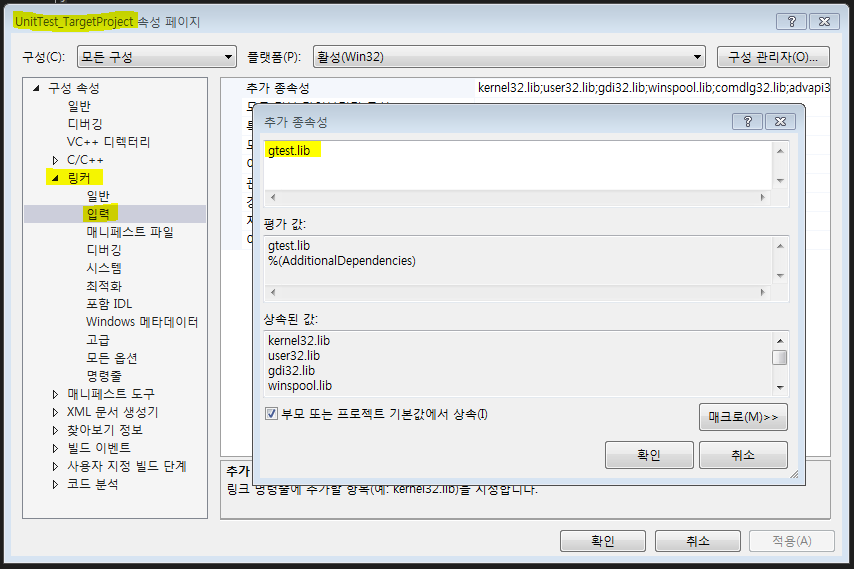  
> Trouble Shooting  
  `msvcprtd.lib(MSVCP140D.dll)에 이미 정의되어 있습니다.` 오류 시   
  런타임 라이브러리를 **다중 스레드 디버그** 로 변경  
  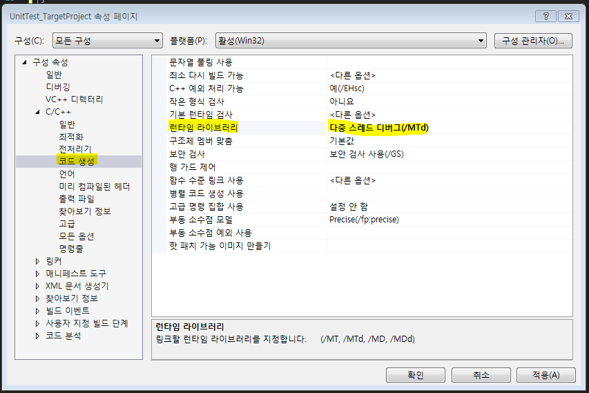    

## Mocking library 추가
- FakeIt : https://github.com/eranpeer/FakeIt
- fakeit.hpp 다운로드  
  https://github.com/eranpeer/FakeIt/tree/master/single_header/gtest
- Test Project에 복사  
  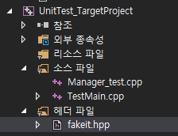    

## 테스트 프로젝트에 대상 프로젝트 참조 설정
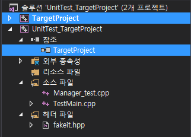  

## Test Case
### UnitTest_TargetProject
- TestMain.cpp  
  ```cpp
  #include "gtest/gtest.h"
  #include <ostream>
  #include <assert.h>

  int main(int argc, char* argv[])
  {
  	testing::InitGoogleTest(&argc, argv);
  	RUN_ALL_TESTS();
  	getchar();
  }
  ```
- Manager_test.cpp  
  ```cpp
  #include "gtest/gtest.h"
  #include "fakeit.hpp"
  #include "../TargetProject/Manager.h"

  using namespace fakeit;

  namespace {
  	class ManagerTest : public ::testing::Test {
  	protected:
  		ManagerTest() {}
  		~ManagerTest() {}
  		virtual void SetUp() {}
  		virtual void TearDown() {}
  	};

  	TEST_F(ManagerTest, isAccessable) {
  		Mock<IChecker> checkerMock;
  		When(Method(checkerMock, checkSomething)).Return(true);

  		IChecker &i = checkerMock.get();

  		Manager manager(&i);

  		EXPECT_EQ(true, manager.isAccessible("TEST_ID"));
  		Verify(Method(checkerMock, checkSomething).Using("TEST_ID")).Exactly(1);
  	}
  }
```

### TargetProject
- Manager.h    
  ```cpp
  #pragma once
  #include <string>
  #include "Checker.h"

  using namespace std;

  class Manager
  {
  public:
  	Manager();
  	Manager(IChecker* pChecker);
  	~Manager();

  	bool isAccessible(string id);
  private:
  	IChecker * m_Checker;
  };
  ```

- Manager.cpp  
  ```cpp
  #include "Manager.h"

  Manager::Manager()
  {
  	m_Checker = new Checker();
  }
  Manager::Manager(IChecker* pChecker)
  {
  	m_Checker = pChecker;
  }
  Manager::~Manager(){}

  bool Manager::isAccessible(string id)
  {
  	return m_Checker->checkSomething(id);
  }
  ```

- Checker.h  
  ```cpp
  #pragma once
  #include <string>

  using namespace std;

  class IChecker {
  public:
  	virtual bool checkSomething(const string id) = 0;
  };

  class Checker : public IChecker
  {
  public:
  	Checker();
  	~Checker();

  	void doSomething();
  	bool checkSomething(const string id) {
  		return true;
  	}
  };
  ```

- Checker.cpp  
  ```cpp
  #include "Checker.h"

  Checker::Checker(){}
  Checker::~Checker(){}

  void Checker::doSomething()
  {
  	// do something
  }
  ```

## Run Test
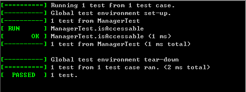  


## 참조 페이지
- http://m.blog.naver.com/answn3475/220805359303
- http://blog.naver.com/PostView.nhn?blogId=knix008&logNo=220727805327
- https://github.com/google/googletest
- https://github.com/google/googletest/blob/master/googletest/docs/Primer.md
- https://github.com/eranpeer/FakeIt
